##Wykonane zostało:

- [x] Wczytywanie obrazu z pliku - imread()
- [x] Wczytywanie kształtu obrazu - image.shape()
- [x] Wyświetlanie obrazu - imshow()
- [x] Pobranie wartości RGB
- [x] Pobranie wycinka obrazu
- [x] Obracanie obrazu - rotate()
- [x] Zmiana rozmiaru obrazu - resize()
- [x] Rysowanie prostokąta na obrazie - rectangle()
- [x] Rysowanie okręgu na obrazie - circle()
- [x] Rysowanie linii na obrazie - line()
- [x] Pisanie tekstu na obrazie - putText()
- [x] Zmiana koloru obrazu na odcienie szarości - cvtColor()
- [x] Wykrywanie krawędzi na obrazie - findContours()
- [x] Rysowanie konturów obrazu - drawContours()
- [x] Redukowanie "szumów" na obrazie - erode()

### Original

### ROI
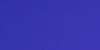

### Resized
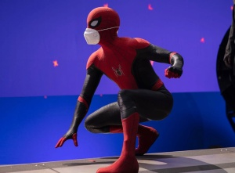

### Rotated
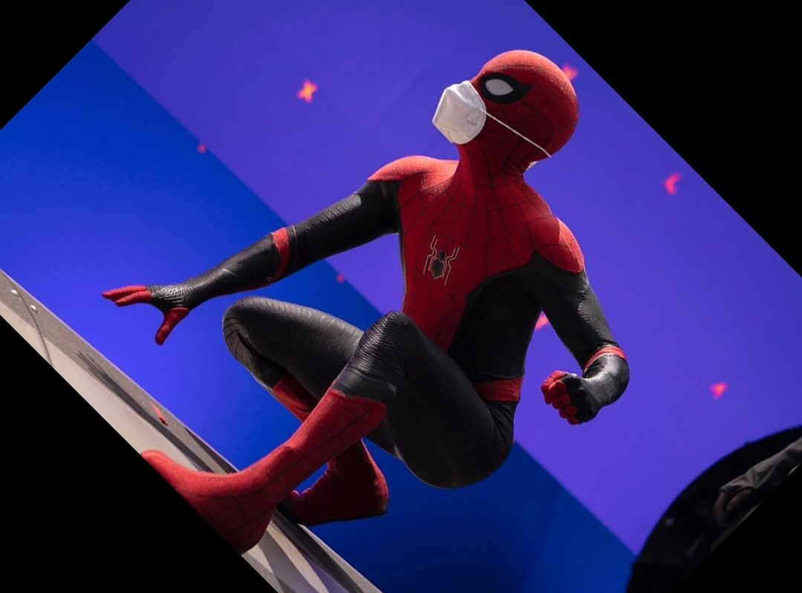

### Bound & Rotated
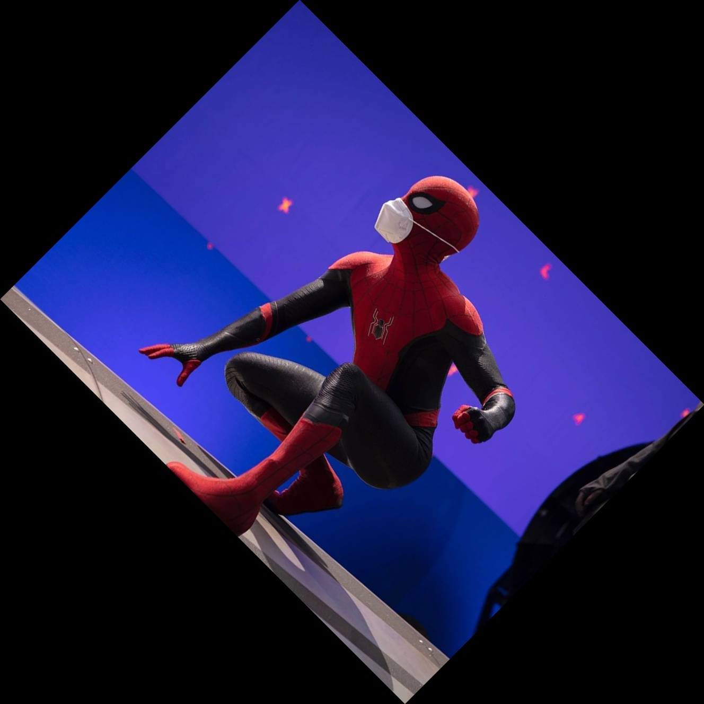

### Blurred

### Rectangle

### Circle

### Line

### Text
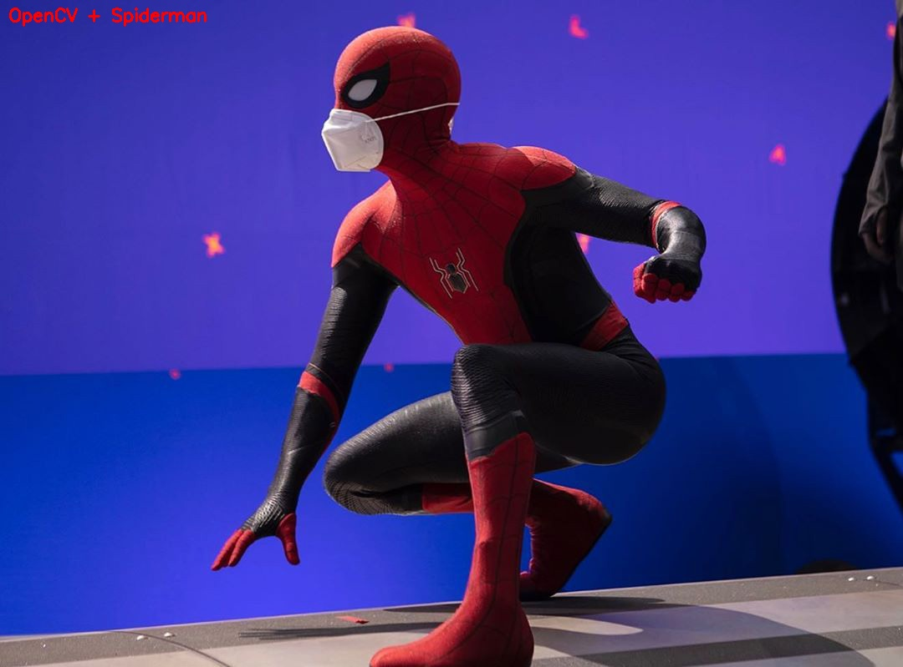

### Gray
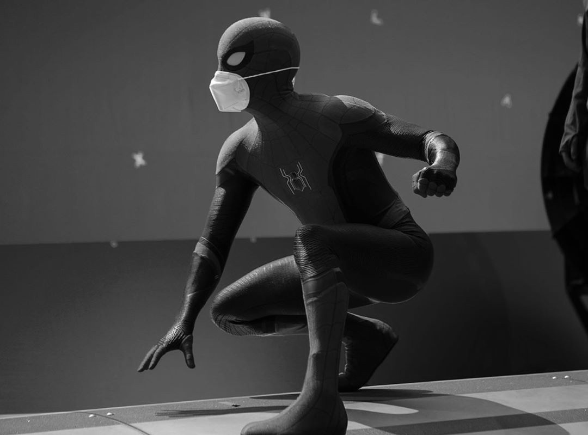

### Edged
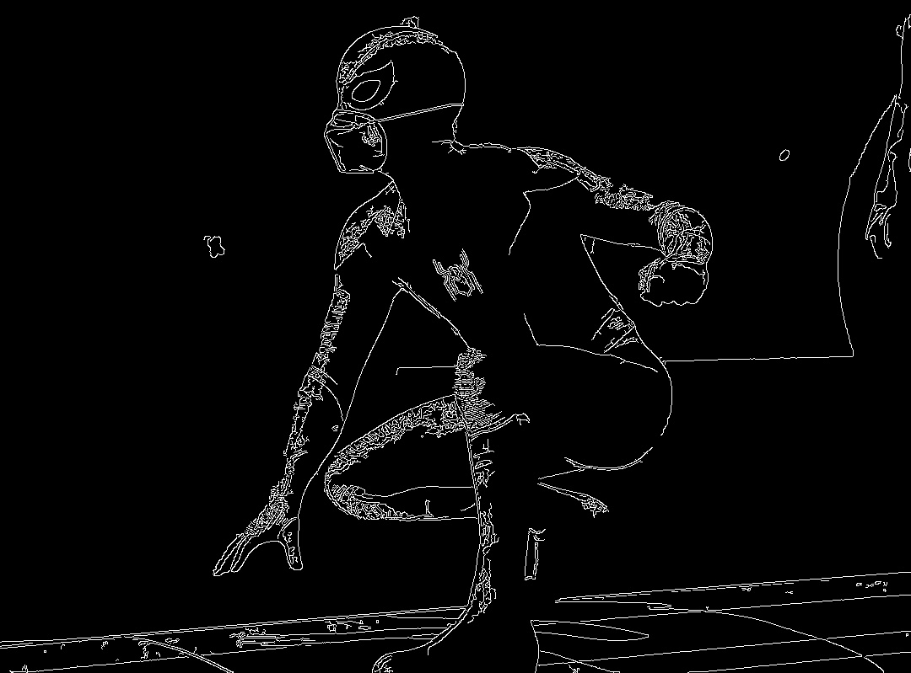

### Threshold
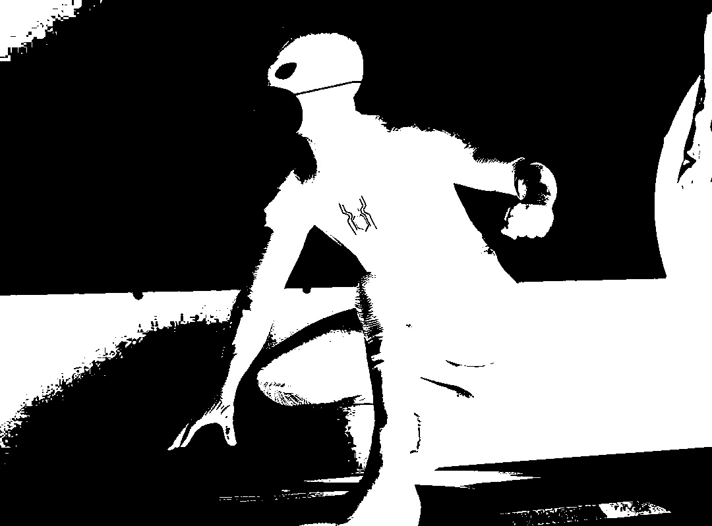

### Contours
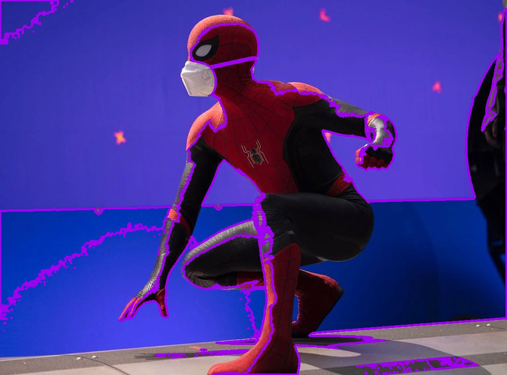

### Contours & Text

### Eroded
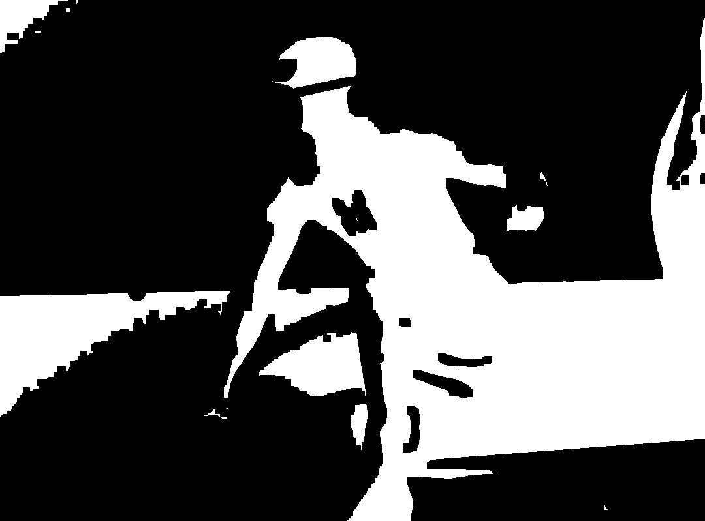

### Dilated
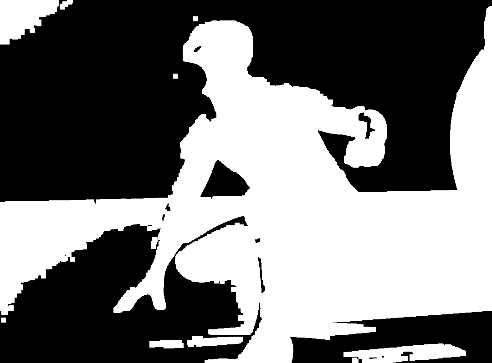

### Bitwise
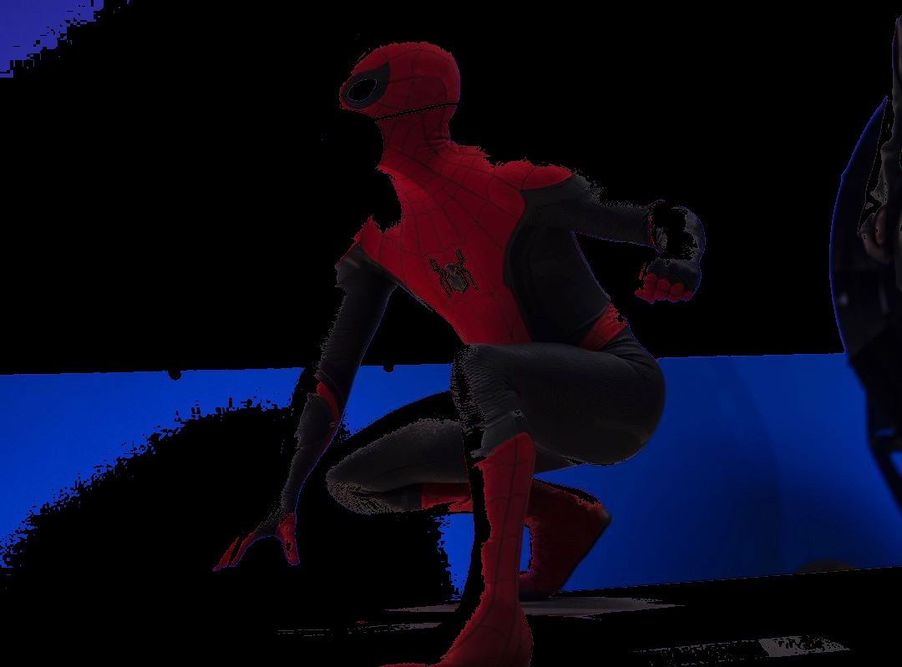